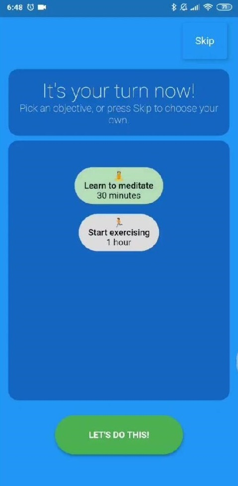

Do you like doing... *stuff*? This application should be perfect for you! At least, once it will be released...

# Introduction

This is a short, quick and informal analysis of a simple application that I developed during the attendance of the *Mobile Programming and Multimedia* course, given in the [University of Padua](http://informatica.math.unipd.it/laureamagistrale/mobileprogrammingemultimediaen.html).

## Motivations

What is **persuasive technology**?

[Wikipedia](https://en.wikipedia.org/wiki/Persuasive_technology) reports a brief definition, defined by [B. J. Fogg](https://dl.acm.org/doi/10.1145/764008.763957):

> **Persuasive technology** is broadly defined as technology that is designed to change attitudes or behaviors of the users through persuasion and social influence, but not through coercion.

This novel field of study exploits the natural human behavior to lead a user to perform a desired action. For example, why do we keep scrolling the Facebook homepage? Social scientists study many techniques in order to dissuade a user to perform an action.

This is **not** inherently good or bad: we could use these tricks to realize a powerful and intuitive UI for an application, designing an interface that is accessible for the greatest number of users.

This type of sciences can be, sadly, used with other intentions in mind: a wonderful video was produced by [PolyMatter](https://www.youtube.com/channel/UCgNg3vwj3xt7QOrcIDaHdFg), a YouTube channel about technology and economics. This video reports how the current mobile gaming market uses those techniques to merely increase revenue.

<iframe width="560" height="315" src="https://www.youtube.com/embed/70bhC9616zk" frameborder="0" allow="accelerometer; autoplay; encrypted-media; gyroscope; picture-in-picture" allowfullscreen></iframe>

## Moti

What are some positive applications of these techniques?

This app wants to answer this specific question: *Moti* is a mobile app that implements a simple tool to enable the user to plan his **personal objectives**, by assisting the user in the creation of a good subdivision and leading him by exploiting *gamification* and *persuasive design* techniques, in order to complete the objective desired.

The added value of the app is represented by the implementation of the [Fogg Behavior Model](https://www.behaviormodel.org/) and the [Fogg Behavior Grid](https://www.behaviorgrid.org/): the application is able to identify the best strategy to use, based on the specific characteristics of the objective and of the user.

## Related works

Some popular apps were crucial to the development of Moti.

### Reflectly

|                          | Description                         |
| ------------------------ | ----------------------------------- |
| Name                     | [Reflectly](https://reflectly.app/) |
| Installation (June 2019) | 1 500 000+                          |
| Model                    | Freemium, with premium subscription |
| Average score            | 4.1 (Android), 4.5 (iOS)            |

The application is mainly a personal diary used to reflect on the daily activities of the user. It uses artificial intelligence to help the user to overcome negative thoughts and to educate him to the best psychological practices to face his issues. The techniques implemented are based on *positive psychology* and *cognitive behavioral therapy* (CBT).

## Daylio

|                          | Description                          |
| ------------------------ | ------------------------------------ |
| Name                     | [Daylio](https://daylio.webflow.io/) |
| Installation (June 2019) | 1 000 000+                           |
| Model                    | Freemium, with single purchase       |
| Average score            | 4.8 (Android), 4.8 (iOS)             |

The app is similar to Reflectly, although with a simpler and cleaner interface. Its structure enables the user to have a keyboard-free interaction, making the creation of a personal diary faster and less demanding.

# Showcase

<video src="../content/gif/tutorial0.mp4" width="640" preload autoplay></video>
<video src="../content/gif/tutorial1.mp4" width="640" controls preload></video>

<video src="../content/gif/suggestion.mp4" width="640" controls preload></video>
<video src="../content/gif/firstachievement.mp4" width="640" controls preload></video>
<video src="../content/gif/swipeup.mp4" width="640" controls preload></video>
<video src="../content/gif/pickatask.mp4" width="640" controls preload></video>
<video src="../content/gif/ending.mp4" width="640" controls preload></video>

